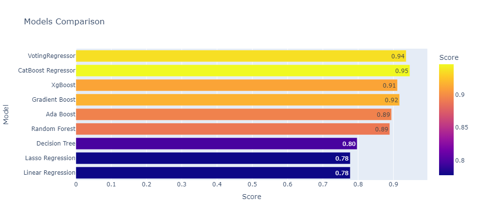

基于机器学习的混凝土抗压强度预测

数据来源：[https://www.kaggle.com/datasets/sinamhd9/concrete-comprehensive-strength](https://www.kaggle.com/datasets/sinamhd9/concrete-comprehensive-strength)

---

#### 完整流程

* 数据描述
* 清洗与预处理
* 特征工程
* 模型构建与评估
* 模型融合

#### 实现效果($R^2$)

---

【补充内容1】：2σ与3σ、箱线图异常值处理；

【补充内容2】：特征重要性、强度与养护期的变化；
